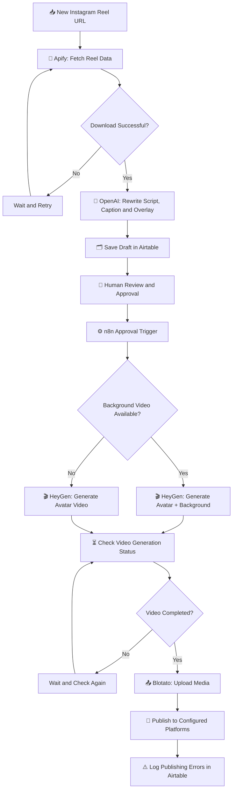

# 🎬 Rahul's Viral Avatar Cloning — AI Content Automation Pipeline

  <strong>From Instagram Reel Research to AI Avatar Video Generation and Social Media Publishing</strong>

  
  
  
  
  

## 🚀 Overview

**Rahul's Viral Avatar Cloning** is an AI-powered content automation pipeline built with **n8n** to streamline the process of discovering content, generating engaging scripts, creating AI avatar videos, and distributing content across social media platforms.

I developed this automation for a client with **500K+ followers on Instagram**, helping streamline their short-form content production workflow through AI agents, API integrations, and automated publishing workflows.

The system combines content ingestion, AI-assisted script rewriting, human approval, avatar video generation, and social media distribution into a connected workflow.

Instead of manually handling every stage of content production, the pipeline automates repetitive tasks while retaining a human approval step before video generation and publishing.

## ✨ Key Features

- 🔎 **Content Ingestion:** Fetch Instagram Reel content, transcripts, captions, and hashtags using Apify.
- 🤖 **AI-Powered Content Generation:** Rewrite scripts and captions using OpenAI while maintaining the original topic, structure, and style.
- 📝 **Automated Script & Caption Creation:** Generate an avatar script, SEO-friendly caption, hashtags, and a short video overlay.
- 👤 **AI Avatar Cloning:** Generate vertical videos using a configured HeyGen avatar and voice.
- 🎥 **Dynamic Backgrounds:** Support avatar videos with or without a background video.
- ✅ **Human-in-the-Loop Approval:** Store generated drafts in Airtable for review and approval before production.
- 📲 **Multi-Platform Distribution:** Integrate Blotato for uploading media and publishing posts to supported social platforms.
- 🔄 **Status Monitoring:** Check HeyGen video-generation status before proceeding.
- ⚠️ **Error Logging:** Record publishing errors in Airtable for troubleshooting.

## 🧠 Workflow Architecture

The automation follows a structured, multi-stage content production process.

## 🔄 How It Works

### 1. Content Research and Data Fetching

**Technology: Apify + Airtable**

The workflow begins when a new Instagram Reel URL is added to the source Airtable table.

- Apify fetches the Reel's available content data.
- The workflow checks whether the download was successful.
- Failed downloads follow a wait-and-retry path.
- The retrieved transcript, caption, and hashtags become inputs for the AI content-generation stage.

This creates a structured starting point for transforming existing content into a new short-form video draft.

### 2. AI-Powered Script and Caption Generation

**Technology: OpenAI GPT-4.1-mini + n8n AI nodes**

The AI agent processes the source Reel's transcript, caption, and hashtags to generate three structured outputs:

| Output | Purpose |
| --- | --- |
| `Script` | A rewritten avatar narration script designed for approximately 30 seconds of speech. |
| `Caption` | An SEO-friendly social media caption with relevant hashtags. |
| `Overlay` | A short, attention-grabbing sentence for the video. |

The configured prompt instructs the model to maintain the source topic, structure, and style while introducing fresh value and a strong opening hook.

The results are returned through a structured output parser and stored in Airtable as an unapproved draft.

### 3. Human Review and Approval

**Technology: Airtable + n8n**

Before the video is generated, the workflow uses an approval-based process.

- Generated scripts, captions, and overlays are saved in Airtable.
- The draft's approval field is initially set to `false`.
- A separate Airtable trigger monitors records for approval-related updates.
- Once the record meets the configured approval criteria, the workflow proceeds to video generation.

This provides a review checkpoint before the pipeline consumes video-generation resources or proceeds toward publishing.

### 4. AI Avatar Video Generation

**Technology: HeyGen API**

Once a draft is approved, n8n sends a request to HeyGen to generate an avatar video.

The workflow supports two generation paths:

**With a background video**
- Uses a configured avatar and voice.
- Adds a supplied background video.
- Supports looping and cover-style background fitting.

**Without a background video**
- Generates an avatar-led video using the configured avatar and voice.

The configured output format is **720 × 1280 pixels (9:16 vertical video)**, suitable for short-form social content.

The generated video uses configurable avatar, voice, and API settings. n8n then waits and checks the generation status until the completion condition is met.

### 5. Media Upload and Social Media Publishing

**Technology: Blotato API / n8n integration**

After HeyGen reports a completed video, the workflow uploads the generated media through Blotato.

The workflow contains publishing nodes for:

- Instagram
- YouTube
- TikTok
- Facebook
- LinkedIn
- Pinterest
- X (Twitter)
- Threads
- Bluesky

These integrations provide a foundation for distributing generated content across multiple social platforms from a single automation.

**Important:** In the exported workflow, Instagram's publishing node is enabled, while the other platform-specific publishing nodes are disabled by default. Additional platforms require the appropriate configuration, credentials, and testing before use.

### 6. Error Handling and Logging

**Technology: n8n + Airtable**

The workflow includes error-handling paths for publishing operations.

- Publishing nodes can route errors to a shared error-handling path.
- Error messages are merged and written to Airtable.
- Retry settings are configured on selected media and publishing operations.

This provides visibility into failed publishing attempts and helps simplify troubleshooting.

## 🛠️ Technology Stack

| Technology | Role |
| --- | --- |
| **n8n** | Workflow orchestration and automation |
| **Apify** | Instagram Reel data extraction |
| **OpenAI GPT-4.1-mini** | Script, caption, and overlay generation |
| **HeyGen API** | AI avatar and voice video generation |
| **Blotato** | Media upload and social media publishing |
| **Airtable** | Content tracking, draft management, approval, and error logging |

## ⚙️ Configuration and Setup

### Prerequisites

Before running the workflow, ensure you have:

- An n8n instance.
- Access to the required Apify actor and API credentials.
- An OpenAI API connection configured in n8n.
- A HeyGen API key, avatar ID, and voice ID.
- A Blotato account with the required social media connections.
- Airtable access, including the appropriate base, tables, fields, and API credentials.

### Setup Steps

1. **Import the workflow:** Import the exported JSON file into your n8n instance.
2. **Configure Airtable:** Connect the relevant tables and verify the source Reel, generated draft, approval, background URL, and error-log fields.
3. **Configure Apify:** Set up the actor and input parameters required to retrieve Reel data.
4. **Configure OpenAI:** Connect the model credentials used by the AI content-generation node.
5. **Configure HeyGen:** Set the API key, avatar ID, and voice ID in the workflow's setup node.
6. **Configure Blotato:** Connect the required social accounts and configure the media-upload and publishing nodes.
7. **Test the workflow:** Run a test Reel through ingestion, draft generation, approval, video creation, and publishing.
8. **Enable additional platforms if required:** Configure and test each platform before enabling its publishing node.

> **Note:** Importing the workflow does not automatically configure credentials or activate the automation. Verify all node settings and dependencies in your own n8n instance before production use.

## 🔐 Security Considerations

- Never commit API keys, access tokens, passwords, or private credentials to GitHub.
- Store credentials in n8n's credential manager or another appropriate secrets-management system.
- Review exported workflow JSON for sensitive information before sharing it publicly.
- Ensure the use of avatar likenesses, voices, source content, and social media accounts is properly authorized.
- Follow the terms and policies of the connected services and social platforms.

## 📈 Project Impact

This project demonstrates how multiple AI services and automation components can work together to streamline short-form content production.

**Key outcomes of the implementation:**

- Connected content extraction, AI-assisted rewriting, avatar video generation, and publishing into one workflow.
- Introduced an approval checkpoint between content generation and video production.
- Automated repetitive content-processing and media-distribution steps.
- Created a foundation for publishing content across multiple social platforms.
- Built the automation for a client with **500K+ Instagram followers**.

The project focuses on reducing manual coordination across the content lifecycle while keeping the workflow modular and configurable.

## 🎯 Skills Demonstrated

`AI Agents` · `Workflow Automation` · `n8n` · `API Integration` · `Prompt Engineering` · `Content Automation` · `Airtable` · `Video Generation` · `Social Media Automation` · `Error Handling`

## 👨‍💻 Developer

**Gurunanda Punna**

Computer Science Engineering student and AI automation developer, building AI-powered workflows, agentic systems, and automation solutions for real-world use cases.

- GitHub: [@Gurunanda-2006](https://github.com/Gurunanda-2006)
- Project Repository: [Avatar-Cloning-Content-Automation-Pipeline](https://github.com/Gurunanda-2006/Avatar-Cloning-Content-Automation-Pipeline)

---

  <strong>Built with n8n, AI agents, and API integrations.</strong>
   
  Automating the journey from content discovery to AI-generated video publishing.

